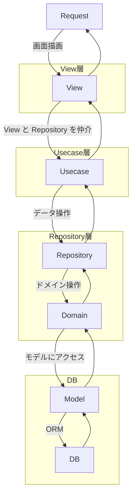

# Staff Attendance

勤怠入力、ワークフロー申請が可能な勤怠管理のSaaSシステム。

## システム

- Environment: docker/devcontainer
- Back-end: Python + Django
- Front-end: Next.js

## アーキテクチャ

### 共通

ドメイン駆動設計で構築。



### バックエンド

```
staff_attendance/
    attendance/			        // urls.py はこの配下に置かない
        migrations/
        models/
            __init__.py
            clock_model.py
            code_master.py
            user_model.py
        static/
        templates/
            clock/			    // 打刻画面のテンプレート
            user/			    // ログイン、ユーザー登録画面のテンプレート
                login.html
                user_entry.html
            workflow/		    // 申請画面のテンプレート
            base.html
            form.html
            ...				    // その他ベースとなるテンプレート
    staff_attendance/
        clock/			        // 打刻ドメイン　user/ とほぼ同等の構成
        user/				    // ユーザードメイン
            views/
                __init__.py
                login.py
                logout.py
                user_entry.py	// 新規ユーザー登録
            domains.py
            forms.py
            repositories.py
            urls.py
            usecases.py
        workflow/			    // ワークフロードメイン
        settings.py
        urls.py
```

### フロントエンド

```
frontend/
```

## 構築状況

- バックエンド
    - ドメインモデルの作成
    - ログイン、ユーザー登録機能の実装
    - 打刻機能の実装
    - ワークフロー申請機能の実装（有給申請のみ）
- フロントエンド
    - 導入のみ
