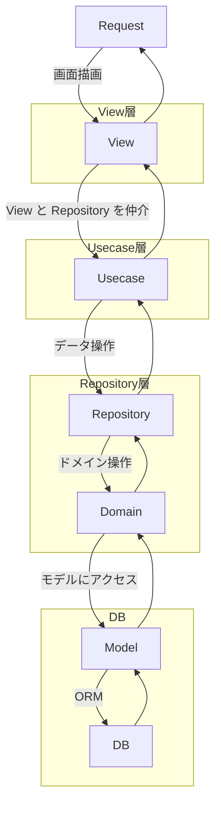

# Staff Attendance

勤怠入力、ワークフロー申請が可能な勤怠管理のSaaSシステム。

## システム

| 区分 | 構成 |
|------|------|
| Environment | Docker / devcontainer（Python 3.12） |
| Back-end | Python + Django 5.1 |
| Front-end | Next.js 16 + React 19 + Tailwind CSS 4 |
| Database | SQLite |

依存パッケージのバージョンは `.devcontainer/requirements.txt` で固定する。Django 6.0 以降は
SQLite 3.37 以上を要求するが、ベースイメージ（bullseye）の SQLite は 3.34 であるため、
5.1 系を使用する。

## フロントエンドの方針

Django テンプレートと Next.js が併存する状態を解消するため、二段階で進める。

1. 第一段階：Django テンプレートで機能を完成させる。新規の画面実装は Django テンプレート側に
   集約する。Next.js、Django REST Framework、django-cors-headers は撤去せず保持する。
2. 第二段階：機能が出揃った時点で API 化を行い、Next.js を SPA として構築する。
   Django テンプレートは段階的に廃止する。

現在は第一段階である。Next.js は導入のみで、`create-next-app` のテンプレートから未着手。

## 開発環境

### セットアップ

`.env.example` を `.env` として複製し、`SECRET_KEY` を設定する。

```bash
cp .env.example .env
```

devcontainer を使用する場合は VS Code から開く。ホストから直接操作する場合は
`Makefile` のタスクを使用する。

```bash
make build   # 開発用イメージをビルドする
make seed    # 初期データを投入する（migrate + loaddata）
make serve   # 開発サーバーを起動する（http://localhost:8000）
```

`make seed` は以下を投入する。

- `CodeMaster`：打刻・勤務場所・ワークフローのステータス（マイグレーション `0016`）
- `Department`：所属部署（`attendance/fixtures/departments.json`）

`CodeMaster` は各機能が前提とする必須マスタのためマイグレーションで投入する。
`Department` は組織固有のデータのため、フィクスチャとして環境ごとに置き換える。

### タスク

`make help` で一覧を表示する。主なタスクは以下。

| タスク | 内容 |
|--------|------|
| `make test` | テストを実行する |
| `make test-file T=<path>` | 指定したテストのみ実行する |
| `make check` | Django の構成チェックを実行する |
| `make migrations` | マイグレーションを作成する |
| `make lint` | flake8 で静的検査を実行する |
| `make shell` | コンテナのシェルを起動する |

`make lint` は違反を検出すると flake8 の仕様により終了コード 1 を返す。

### 画面

| URL | 画面 | 権限 |
|-----|------|------|
| `/` | ログイン | - |
| `/user_entry/` | ユーザー登録 | - |
| `/clock/` | 打刻 | 認証済み |
| `/clock/dashboard/` | ダッシュボード（日次集計） | 認証済み |
| `/workflow/request/` | 申請メニュー | 認証済み |
| `/workflow/request/paid_leave/` | 有給申請 | 認証済み |
| `/workflow/` | ワークフロー選択 | スーパーユーザ |
| `/workflow/approval/` | 承認 | スーパーユーザ |
| `/admin/` | Django 管理画面 | スタッフ |

## アーキテクチャ

### 共通

ドメイン駆動設計で構築。



### バックエンド

```
staff_attendance/
├── attendance/				# urls.py はこの配下に置かない
│   ├── fixtures/
│   │   └── departments.json		# 所属部署の初期データ
│   ├── migrations/
│   ├── models/				# モデル
│   │   ├── __init__.py
│   │   ├── clock_model.py
│   │   ├── code_master.py
│   │   ├── user_model.py
│   │   └── workflow_model.py
│   ├── static/
│   ├── templates/
│   │   ├── clock/			# 打刻画面のテンプレート
│   │   ├── user/			# ログイン、ユーザー登録画面のテンプレート
│   │   │   ├── login.html
│   │   │   └── user_entry.html
│   │   ├── workflow/			# 申請、承認画面のテンプレート
│   │   ├── base.html
│   │   ├── form.html
│   │   └── {other_templates}		# その他、ベースとなるテンプレート
│   └── tests/				# バックエンドのテスト
├── staff_attendance/
│   ├── clock/				# 打刻ドメイン user/ とほぼ同等の構成
│   ├── user/				# ユーザードメイン
│   │   ├── views/
│   │   │   ├── __init__.py
│   │   │   ├── login.py
│   │   │   ├── logout.py
│   │   │   └── user_entry.py		# 新規ユーザー登録
│   │   ├── domains.py
│   │   ├── forms.py
│   │   ├── repositories.py
│   │   ├── urls.py
│   │   └── usecases.py
│   ├── workflow/			# ワークフロードメイン
│   ├── settings.py
│   └── urls.py
└── util/				# ドメインに依存しない共通処理
    ├── base_form_view.py
    ├── base_repository.py
    ├── base_superuser_view.py
    ├── base_user_view.py
    ├── code_master_repository.py
    ├── id_generator.py
    ├── mixins.py
    ├── now.py
    └── round_calc.py
```

### フロントエンド

```
frontend/
├── app/	# create-next-app のテンプレート
└── public/
```

## 構築状況

### バックエンド

| 機能 | 状態 |
|------|------|
| ドメインモデルの作成 | 完了 |
| ログイン、ログアウト | 完了 |
| ユーザー登録 | 完了 |
| 打刻（IN / OUT、勤務場所、休憩時間） | 完了 |
| 日次集計 | 完了 |
| 月次集計 | ロジックのみ。画面は未実装 |
| 有給申請、承認 | 完了 |
| 打刻修正、交通費、勤怠締め | モデルのみ。Usecase / View は未実装 |
| 承認ルート、有給の付与・管理、給与集計 | 未着手 |
| テスト | 86 件 |

### フロントエンド

| 項目 | 状態 |
|------|------|
| Next.js の導入 | 完了 |
| 画面実装 | 未着手（`create-next-app` のテンプレートのまま） |
| API（Django REST Framework） | 未着手（パッケージの導入のみ） |
