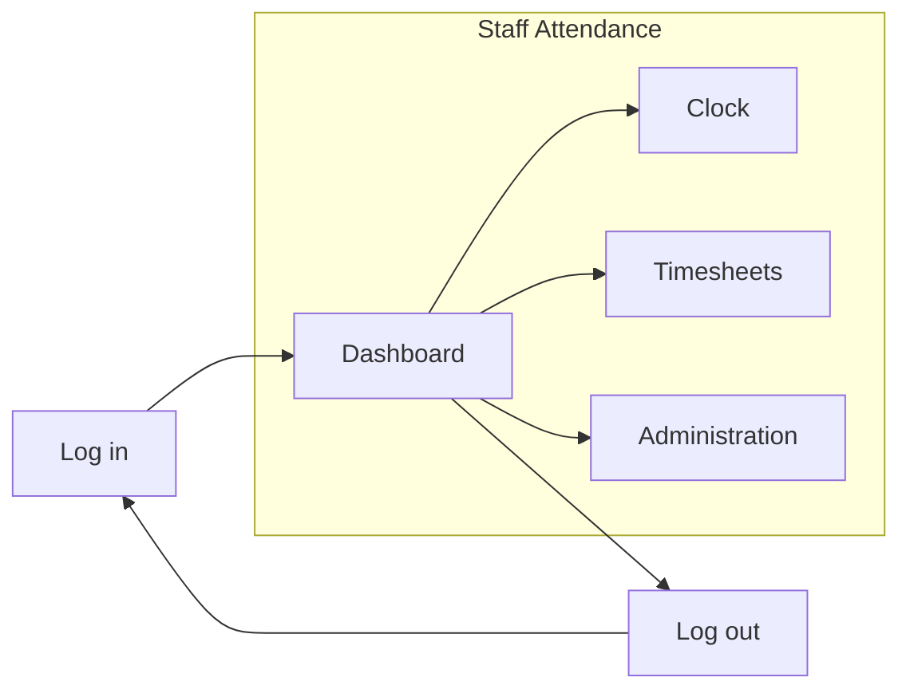

# Staff Attendance

- ログイン / ログアウト
- ユーザー登録
- 打刻
- ワークフロー申請

## 機能設計

1. ユーザー
   - 新規作成
      - ユーザーID（6桁）
      - ユーザー名
      - 所属部署
      - メールアドレス
      - パスワード（英数字/記号 9桁以上）
      - 権限
   - 登録情報確認/変更
      - 登録情報
         - ユーザーID（変更不可）
         - ユーザー名
         - アイコン
         - 所属部署
         - メールアドレス
         - パスワード
            - パスワード再設定
            - 有効期限
         - 権限（変更不可）
      - メール通知
   - ユーザー削除

2. 認証
   - ログイン/ログアウト
   - アクセス履歴

3. 打刻
   - 打刻
      - 打刻
      - 勤務場所
         - Office
         - Telework
      - 打刻の修正
      - 有給申請
   - 設定
      - 定時
      - 休憩時間
      - 交通費
   - 集計
      - 勤務時間
      - 残業時間
      - 給与
      - 深夜賃金
      - 有給
      - 交通費

4. ワークフロー
   - 管理者権限
      - 追加
      - 削除
   - 申請、承認
      - 打刻
      - 有給
         - 付与
         - 管理
         - 通知
      - 交通費
      - 勤怠締め
      - 修正
   - 承認ルート
      - 作成
      - 確認/変更
      - 削除

## 画面設計

## DB設計

1. user table
   - ユーザーID（6桁）
   - ユーザー名
   - アイコン
   - 所属部署（Foreign Key）
   - メールアドレス
   - 有給
   - パスワード（英数字/記号 9桁以上）
   - 二要素認証
   - 管理者権限

2. department table
   - 所属部署

3. clock table
   - ユーザー名（Foreign Key）
   - 日時
   - 打刻
   - 休憩時間
   - 勤務場所

4. workflow table
   - ワークフローID
   - ワークフロー名
   - 申請者（Foreign Key）
   - 承認者（Foreign Key）
   - ステータス
